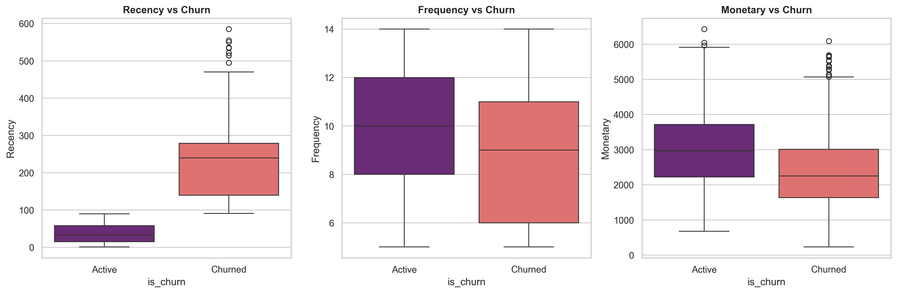
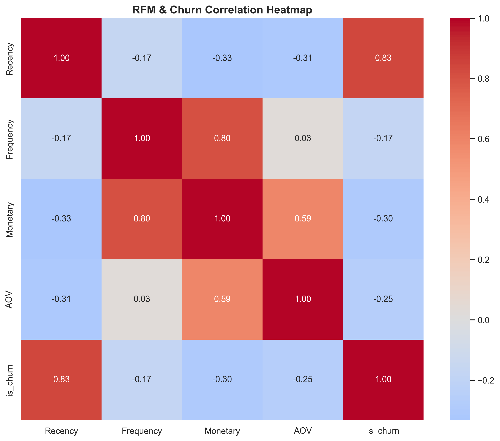
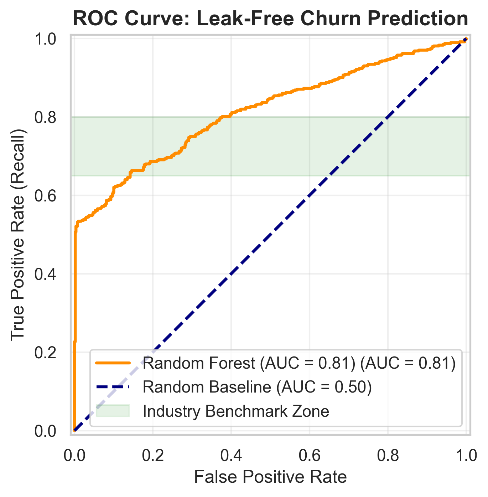
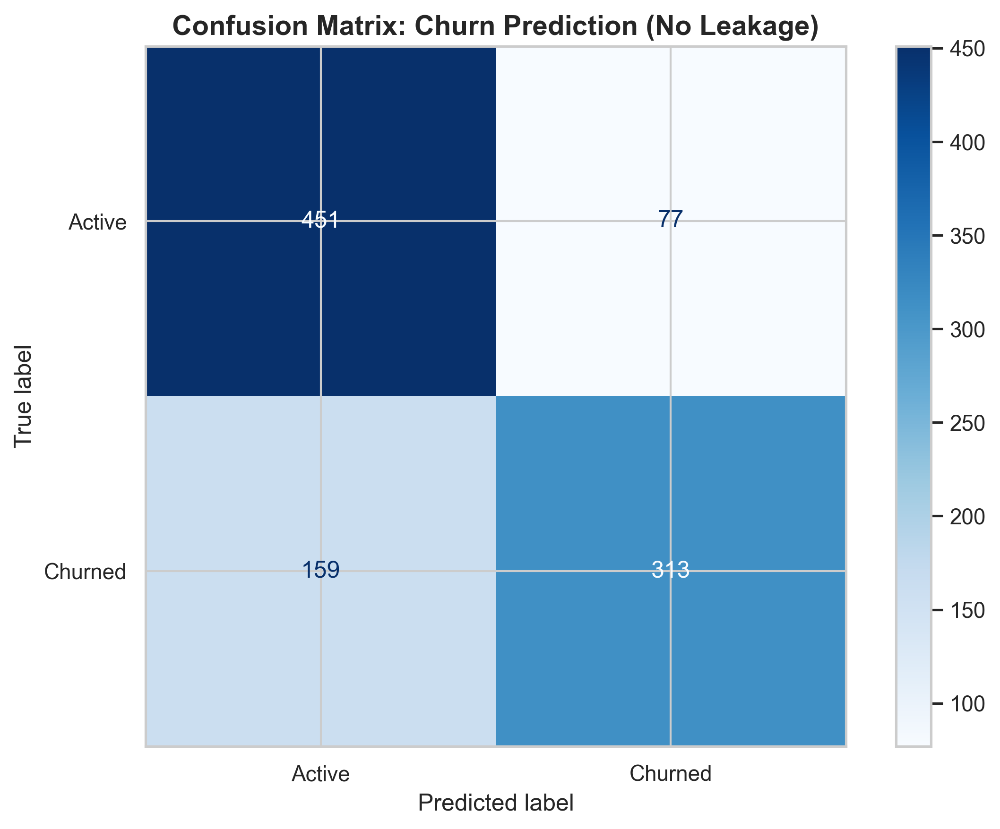
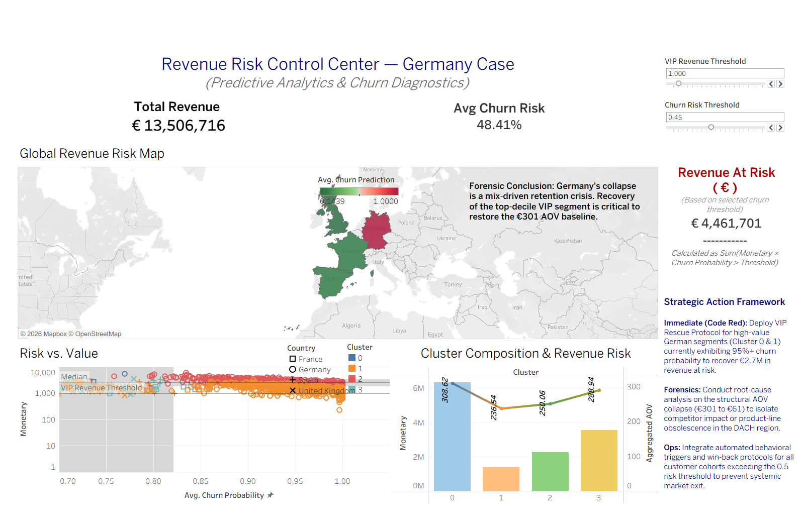

# Revenue Forensics: Structural AOV Failure & Predictive Churn Modeling

### Project Disclaimer
This repository contains a **business analytics simulation**. The dataset is programmatically generated to model a catastrophic **80% revenue collapse** in the German market. This project demonstrates forensic data analysis, statistical validation (Welch's T-Tests), and predictive churn modeling in a production-grade environment.

---

## Executive Summary
A modeled **80% revenue contraction** was observed in the German market. Revenue decomposition reveals that while customer counts remained stable, the primary failure was a **structural AOV collapse** (plummeting from **€301 → €61**). 

This drop was driven by the churn of high-value (VIP) segments, confirming a **structural retention failure** rather than a pricing or acquisition issue. The strategic response must shift from "marketing spend increase" to high-value customer recovery and retention governance.

---

## Strategic Insight: Structural Collapse vs. Marginal Dip
At a global level, metrics appeared stable. However, regional-level forensic decomposition exposed:
* **Compositional Shift:** A fundamental deterioration in the customer mix.
* **VIP Attrition:** Disproportionate churn among top-decile customers.
* **AOV Pressure:** Downward pressure driven by the loss of high-ticket transactions.

This was not a marginal fluctuation; it was a **mix-driven structural deterioration** that required deep-dive behavioral analytics to uncover.

---

## Technical & Methodological Stack

### **Analytics & Data Science**
* **Python:** Pandas, NumPy for data manipulation.
* **Statistical Testing:** Welch’s T-Test (accounting for unequal variances).
* **Machine Learning:** Scikit-Learn (Random Forest Classifier).
* **Testing:** Pytest for logic and pipeline validation.

### **Business Frameworks**
* **Revenue Decomposition:** Analysis of Price × Volume × Mix drivers.
* **RFM Segmentation:** Recency, Frequency, and Monetary grouping.
* **Cohort Analysis:** Tracking behavioral decay across high-value groups.

### **Model Governance**
* **Zero Target Leakage:** Explicit exclusion of Recency from features.
* **Performance:** Validation **AUC: 0.815**.
* **Strategy:** Recall-prioritized classification to capture maximum financial risk.

---

## Analytical Track 1: Revenue Forensics & Statistical Validation

### **The Core Question**
Is the decline driven by pricing, volume, or customer composition?

Isolating the root cause through Year-over-Year (YoY) benchmarking and statistical validation.


### **Key Findings**
* **AOV Distortion:** Germany's AOV plummeted by 80%, directly correlated with VIP churn.
* **Statistical Significance:** Welch’s T-Test confirms the revenue drop is **statistically significant ($p < 0.05$)**, ruling out random variance.
* **Correlation Insights:**
    * **Recency:** Serves as a status indicator (current state).
    * **Frequency Volatility & AOV Trends:** Identified as the primary **leading indicators** of impending churn.



---

## Analytical Track 2: Predictive Behavioral Modeling

### **Eliminating Target Leakage**
In this production-grade pipeline, **Recency was intentionally excluded** as a feature. 
* **The Reason:** Churn is defined as `Recency > 90 days`. Including it would produce an inflated, useless AUC (~0.99).
* **The Solution:** The model is forced to learn from **behavioral signals**:
    * Engagement density and Frequency stability.
    * AOV trend behavior and Monetary velocity.
    * **FM Risk Ratios:** Engineered features capturing the relationship between visit counts and spend.

### **Model Performance**
* **Validation AUC: 0.815** (High predictive power for a leak-free behavioral model).
* **Recall Prioritization:** Optimized to capture "at-risk" customers (minimizing False Negatives).
* **Business Utility:** The model surfaces early-stage financial risk signals *before* the customer officially churns.




---

## 💶 Financial Exposure Layer: Revenue-at-Risk
The model output is translated into a financial framework that enables:
1. **Quantification:** Calculating the exact € value of exposed revenue.
2. **Threshold Sensitivity:** Adjustable churn probability sliders for different risk appetites.
3. **VIP Sensitivity:** Highlighting exposure within top-tier monetary segments.

---

## Interactive Executive Control Center (Tableau)
The predictive output is integrated into a decision-support dashboard for C-level monitoring:
* **Revenue-at-Risk (€):** Real-time quantification of financial exposure.
* **Scenario Simulation:** Dynamic adjustment of churn thresholds.
* **Action Mapping:** Cluster-based intervention strategies for VIP recovery.



> [**View Interactive Dashboard on Tableau Public**](https://public.tableau.com/app/profile/tamar.javakhishvili/viz/GlobalRevenueRiskMap/RevenueRiskControlCenterGermanyCaseDashboars?publish=yes)

---

| Timeline | Strategic Action |
| :--- | :--- |
| **Immediate (0–30 Days)** | **VIP Reactivation:** Direct outreach to top-decile at-risk customers identified by the model. |
| **Mid-Term (30–90 Days)** | **Trigger Automation:** Integrate churn probability scores into CRM for automated win-back protocols. |
| **Long-Term** | **Mix Governance:** Country-level AOV monitoring and early behavioral risk detection integrated into BI. |

## Project Structure

```text
Revenue Collapse In Global E-commerse/
├── data/           # Raw and processed datasets (scenario-based)
├── src/            # Core modules: data_loader.py, analysis.py, models.py
├── notebooks/      # Exploratory & validation workflows (EDA)
├── images/         # Visual validations (ROC, Heatmaps, Boxplots)
├── tests/          # Automated unit tests (Pytest)
├── config.json     # Dynamic simulation parameters
└── setup.py        # Packaging & dependencies